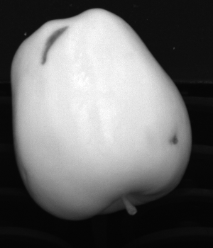

# Fruit-Inspection
A software system aimed at locating defects and imperfections on fruits. Each fruit is acquired through a NIR (Near Infra-Red) and a color camera with little parallax effect.

    
